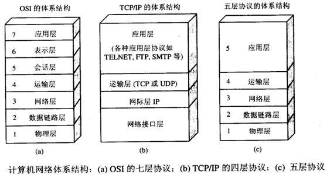
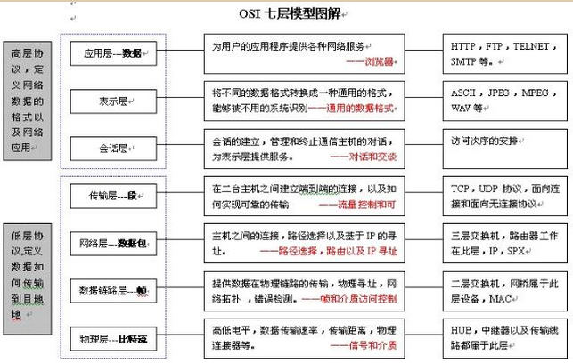
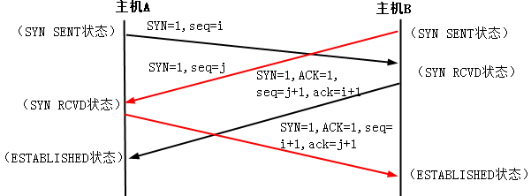
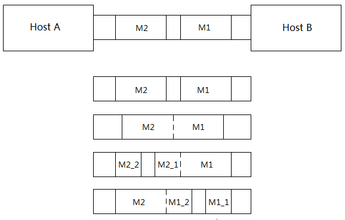
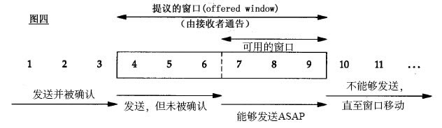
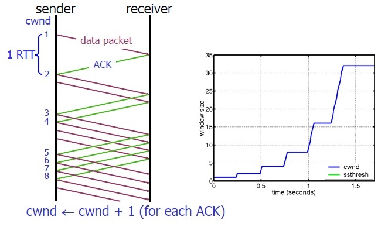
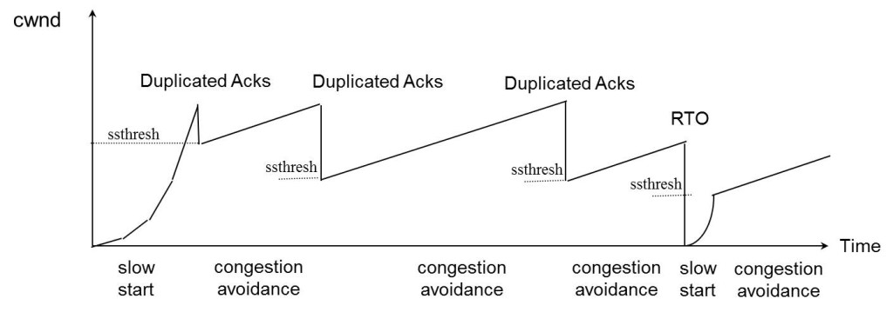
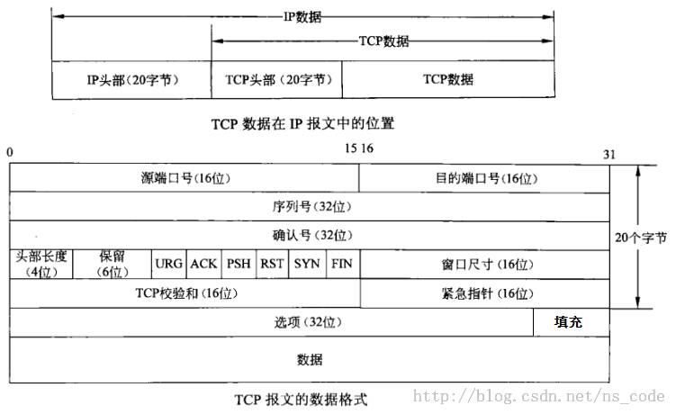

# 网络
## 网络参考模型

OSI的七层的功能和对应TCP\IP协议族的协议

OSI中的层  | 功能                                   | TCP/IP协议族
---        | ---                                    | ---
应用层     | 文件传输，电子邮件，文件服务，虚拟终端 | TFTP，HTTP，SNMP，FTP，SMTP，DNS，Telnet
表示层     | 数据格式化，代码转换，数据加密         | 没有协议
会话层     | 解除或建立与别的接点的联系             | 没有协议
传输层     | 提供端对端的接口                       | TCP，UDP
网络层     | 为数据包选择路由                       | IP，ICMP，RIP，OSPF，BGP，IGMP
数据链路层 | 传输有地址的帧以及错误检测功能         | SLIP，CSLIP，PPP，ARP，RARP，MTU
物理层     | 以二进制数据形式在物理媒体上传输数据   | ISO2110，IEEE802，IEEE802.2

OSI参考模型是ISO的建议，它是为了使各层上的协议国际标准化而发展起来的。OSI参考模型全称是开放系统互连参考模型(Open System Interconnection Reference Model)。这一参考模型共分为七层：物理层、数据链路层、网络层、传输层、会话层、表示层和应用层。

1. 物理层(Physical Layer)主要是处理机械的、电气的和过程的接口，以及物理层下的物理传输介质等。二进制的传输信号编码。
2. 数据链路层(Data Link Layer)的任务是加强物理层的功能，使其对网络层显示为一条无错的线路。两个辅助层：媒介访问控制层 （MAC）和逻辑链路控制层 （LLC）
3. 网络层(Network Layer)逻辑编址和路径决定。路由选择。汇报投递错误。确定分组从源端到目的端的路由选择。路由可以选用网络中固定的静态路由表，也可以在每一次会话时决定，还可以根据当前的网络负载状况，灵活地为每一个分组分别决定。
4. 传输层(Transport Layer)提供可靠的终端对终端的连接，对数据进行数据包按照合适的序列进行分割和重组。同时进行流量控制。从会话层接收数据，并传输给网络层，同时确保到达目的端的各段信息正确无误，而且使会话层不受硬件变化的影响。通常，会话层每请求建立一个传输连接，传输层就会为其创建一个独立的网络连接。但如果传输连接需要一个较高的吞吐量，传输层也可以为其创建多个网络连接，让数据在这些网络连接上分流，以提高吞吐量。而另一方面，如果创建或维持一个独立的网络连接不合算，传输层也可将几个传输连接复用到同一个网络连接上，以降低费用。除了多路复用，传输层还需要解决跨网络连接的建立和拆除，并具有流量控制机制。
5. 会话层(Session Layer)负责在网络中的两节点之间建立和维持通信。建立、管理、终止应用程序兼的通信链接。允许不同机器上的用户之间建立会话关系，既可以进行类似传输层的普通数据传输，也可以被用于远程登录到分时系统或在两台机器间传递文件。
6. 表示层(Presentation Layer)应用层的标准数据接口。MIME编码，数据加密，转换等。用于完成一些特定的功能，这些功能由于经常被请求，因此人们希望有通用的解决办法，而不是由每个用户各自实现。
7. 应用层(Application Layer)为应用程序提供网络服务。其中包含了大量人们普遍需要的协议。不同的文件系统有不同的文件命名原则和不同的文本行表示方法等，不同的系统之间传输文件还有各种不兼容问题，这些都将由应用层来处理。此外，应用层还有虚拟终端、电子邮件和新闻组等各种通用和专用的功能。

TCP/IP参考模型是首先由ARPANET所使用的网络体系结构。这个体系结构在它的两个主要协议出现以后被称为TCP/IP参考模型(TCP/IP Reference Model)。这一网络协议共分为四层：网络访问层、互联网层、传输层和应用层

1. 网络访问层(Network Access Layer)在TCP/IP参考模型中并没有详细描述，只是指出主机必须使用某种协议与网络相连。
2. 互联网层(Internet Layer)是整个体系结构的关键部分，其功能是使主机可以把分组发往任何网络，并使分组独立地传向目标。这些分组可能经由不同的网络，到达的顺序和发送的顺序也可能不同。高层如果需要顺序收发，那么就必须自行处理对分组的排序。互联网层使用因特网协议(IP，Internet Protocol)。TCP/IP参考模型的互联网层和OSI参考模型的网络层在功能上非常相似。
3. 传输层(Tramsport Layer)使源端和目的端机器上的对等实体可以进行会话。在这一层定义了两个端到端的协议：传输控制协议(TCP，Transmission Control Protocol)和用户数据报协议(UDP，User Datagram Protocol)。TCP是面向连接的协议，它提供可靠的报文传输和对上层应用的连接服务。为此，除了基本的数据传输外，它还有可靠性保证、流量控制、多路复用、优先权和安全性控制等功能。UDP是面向无连接的不可靠传输的协议，主要用于不需要TCP的排序和流量控制等功能的应用程序。
4. 应用层(Application Layer)包含所有的高层协议，包括：虚拟终端协议(TELNET，TELecommunications NETwork)、文件传输协议(FTP，File Transfer Protocol)、电子邮件传输协议(SMTP，Simple Mail Transfer Protocol)、域名服务(DNS，Domain Name Service)、网上新闻传输协议(NNTP，Net News Transfer Protocol)和超文本传送协议(HTTP，HyperText Transfer Protocol)等。TELNET允许一台机器上的用户登录到远程机器上，并进行工作；FTP提供有效地将文件从一台机器上移到另一台机器上的方法；SMTP用于电子邮件的收发；DNS用于把主机名映射到网络地址；NNTP用于新闻的发布、检索和获取；HTTP用于在WWW上获取主页。

五层模型 现在用的 TCP/IP 模型，应该是来自 DoD 所定义的四层模型，所以标准的 TCP/IP 就是四层。业界实际会采用的是五层。

1. 物理层 第一层对应于基本网络硬件，如同ISO七层参考模型一样。
2. 网络接口层 第二层协议规定了怎样把数据组织成帧及计算机怎样在网络中传输帧，类似于ISO七层参考模型的第二层。
3. 互联网层 第三层协议规定了互联网中传输的包格式及从一台计算机通过一个或多个路由器到最终目标的包转发机制。
4. 传输层 第四层协议，象ISO七层参考模型的第四层一样，规定了怎样确保可靠性传输。
5. 应用层 第五层协议对应于ISO七层参考模型的第六层和第七层，第五层协议规定了应用程序怎样使用互联网。

## TCP与UDP的区别？

1. TCP是面向连接的传输控制协议，而UDP提供了无连接的数据报服务；
2. TCP具有高可靠性，确保传输数据的正确性，不出现丢失或乱序；UDP在传输数据前不建立连接，不对数据报进行检查与修改，无须等待对方的应答，所以会出现分组丢失、重复、乱序，应用程序需要负责传输可靠性方面的所有工作；
3. TCP无界，UDP有界；TCP通过字节流传输，UDP中每一个包都是单独的。对于TCP客户端分好几次发送的数据，而服务端一次性接收所有数据；而UDP客户端发送一次，服务端也只会一次一次地接收
4. 也正因为以上特征，UDP具有较好的实时性，工作效率较TCP协议高；
5. UDP段结构比TCP的段结构简单，因此网络开销也小。TCP建立连接需要开销较多(时间，系统资源)。

## 在什么情况下使用tcp,在什么情况下用udp

简单的说：UDP在需要进行快速连接而对稳定性、可靠性没有什么要求（或者稳定性、可靠性有保证）的情况下比TCP好。

因为TCP是面向连接的可靠连接，为了保证传输和连接的可靠，需要通过三次握手建立连接，所以建立连接的时间较UDP长。

而UDP是非面向连接的不可靠连接，它是不管是否建立了可靠连接都可以进行数据传输的，这样省去了建立连接的时间。一般用于短距离传输，或者是稳定性得到保证的网络，或者是对于连接速度的要求高于对稳定性要求的地方，像短信，游戏。

## TCP连接和释放

TCP三次握手的过程

1. 第一次握手：建立连接时，客户端A发送SYN包（SYN=j）到服务器B，并进入SYN_SEND状态，等待服务器B确认。
2. 第二次握手：服务器B收到SYN包，必须确认客户A的SYN（ACK=j+1），同时自己也发送一个SYN包（SYN=k），即SYN+ACK包，此时服务器B进入SYN_RECV状态。
3. 第三次握手：客户端A收到服务器B的SYN＋ACK包，向服务器B发送确认包ACK（ACK=k+1），此包发送完毕，客户端A和服务器B进入ESTABLISHED状态，完成三次握手。

完成三次握手，客户端与服务器开始传送数据。

由于TCP连接是全双工的，因此每个方向都必须单独进行关闭。这个原则是当一方完成它的数据发送任务后就能发送一个FIN来终止这个方向的连接。收到一个 FIN只意味着这一方向上没有数据流动，一个TCP连接在收到一个FIN后仍能发送数据。首先进行关闭的一方将执行主动关闭，而另一方执行被动关闭。

1. 客户端A发送一个FIN，用来关闭客户A到服务器B的数据传送（报文段4）。
2. 服务器B收到这个FIN，它发回一个ACK，确认序号为收到的序号加1（报文段5）。和SYN一样，一个FIN将占用一个序号。
3. 服务器B关闭与客户端A的连接，发送一个FIN给客户端A（报文段6）。
4. 客户端A发回ACK报文确认，并将确认序号设置为收到序号加1（报文段7）。

双方同时主动连接的TCP连接建立过程

正常情况下，传输连接都是由一方主动发起的，但也有可能双方同时主动发起连接，此时就会发生连接碰撞，最终只有一个连接能够建立起来。因为所有连接都是由它们的端点进行标识的。如果第一个连接请求建立起一个由套接字（x,y）标识的连接，而第二个连接也建立了这样一个连接，那么在TCP实体内部只有一个套接字表项。

当出现同时发出连接请求时，则两端几乎在同时发送一个SYN字段置1的数据段，并进入SYN_SENT状态。当每一端收到SYN数据段时，状态变为SYN_RCVD，同时它们都再发送SYN字段置1，ACK字段置1的数据段，对收到的SYN数据段进行确认。当双方都收到对方的SYN+ACK数据段后，便都进入ESTABLISHED状态。图10-39显示了这种同时发起连接的连接过程，但最终建立的是一个TCP连接，而不是两个，这点要特别注意。

从图中可以看出，一个双方同时打开的传输连接需要交换4数据段，比正常的传输连接建立所进行的三次握手多交换一个数据段。此外要注意的是，此时我们没有将任何一端称为客户或服务器，因为每一端既是客户又是服务器。

双方主动关闭的TCP连接释放流程

与可以双方同时建立TCP传输连接一样，TCP传输连接关闭也可以由双方同时主动进行（正常情况下都是由一方发送第一个FIN数据段进行主动连接关闭，另一方被动接受连接关闭），如图10-41所示。具体描述如下：

当两端对应的网络应用层进程同时调用CLOSE原语，发送FIN数据段执行关闭命令时，两端均从ESTABLISHED状态转变为FIN WAIT 1状态。任意一方收到对端发来的FIN数据段后，其状态均由FIN WAIT 1转变到CLOSING状态，并发送最后的ACK数据段。当收到最后的ACK数据段后，状态转变化TIME_WAIT，在等待2MSL后进入到CLOSED状态，最终释放整个TCP传输连接。

## 为什么是三次握手

在谢希仁著《计算机网络》第四版中讲“三次握手”的目的是“为了防止已失效的连接请求报文段突然又传送到了服务端，因而产生错误”。在另一部经典的《计算机网络》一书中讲“三次握手”的目的是为了解决“网络中存在延迟的重复分组”的问题。这两种不用的表述其实阐明的是同一个问题。

谢希仁版《计算机网络》中的例子是这样的，“已失效的连接请求报文段”的产生在这样一种情况下：client发出的第一个连接请求报文段并没有丢失，而是在某个网络结点长时间的滞留了，以致延误到连接释放以后的某个时间才到达server。本来这是一个早已失效的报文段。但server收到此失效的连接请求报文段后，就误认为是client再次发出的一个新的连接请求。于是就向client发出确认报文段，同意建立连接。假设不采用“三次握手”，那么只要server发出确认，新的连接就建立了。由于现在client并没有发出建立连接的请求，因此不会理睬server的确认，也不会向server发送数据。但server却以为新的运输连接已经建立，并一直等待client发来数据。这样，server的很多资源就白白浪费掉了。采用“三次握手”的办法可以防止上述现象发生。例如刚才那种情况，client不会向server的确认发出确认。server由于收不到确认，就知道client并没有要求建立连接。”

## 为什么连接的时候是三次握手，关闭的时候却是四次握手？

因为当Server端收到Client端的SYN连接请求报文后，可以直接发送SYN+ACK报文。其中ACK报文是用来应答的，SYN报文是用来同步的。但是关闭连接时，当Server端收到FIN报文时，很可能并不会立即关闭SOCKET，所以只能先回复一个ACK报文，告诉Client端，"你发的FIN报文我收到了"。只有等到我Server端所有的报文都发送完了，我才能发送FIN报文，因此不能一起发送。故需要四步握手。

## 关闭TCP连接一定需要4次挥手吗？

不一定，4次挥手关闭TCP连接是最安全的做法。但在有些时候，我们不喜欢TIME_WAIT 状态（如当MSL数值设置过大导致服务器端有太多TIME_WAIT状态的TCP连接，减少这些条目数可以更快地关闭连接，为新连接释放更多资源），这时我们可以通过设置SOCKET变量的SO_LINGER标志来避免SOCKET在close()之后进入TIME_WAIT状态，这时将通过发送RST强制终止TCP连接（取代正常的TCP四次握手的终止方式）。但这并不是一个很好的主意，TIME_WAIT 对于我们来说往往是有利的。

## 为什么 TIME_WAIT 状态需要保持 2MSL 这么长的时间？

假设最终的ACK丢失，server将重发FIN，client必须维护TCP状态信息以便可以重发最终的ACK，否则会发送RST，结果server认为发生错误。TCP实现必须可靠地终止连接的两个方向 ( 全双工关闭 )，client必须进TIME_WAIT状态，因为client可能面临重发最终ACK的情形。先调用close()的一方会进入TIME_WAIT状态

如果TIME_WAIT状态保持时间不足够长( 比如小于 2MSL)，第一个连接就正常终止了。 第二个拥有相同相关五元组的连接出现，而第一个连接的重复报文到达，干扰了第二个连接。 TCP实现必须防止某个连接的重复报文在连接终止后出现，所以让TIME_WAIT状态保持时间足够长(2MSL) ，连接相应方向上的 TCP 报文要么完全响应完毕，要么被丢弃。建立第二个连接的时候，不会混淆。

## TCP SYN 丢包，重连的时间

关于建连接时SYN超时。试想一下，如果server端接到了client发的SYN后回了SYN-ACK后client掉线了，server端没有收到client回来的ACK，那么，这个连接处于一个中间状态，既没成功，也没失败。于是，server端如果在一定时间内没有收到的TCP会重发SYN-ACK。在Linux下，默认重试次数为5次，重试的间隔时间从1s开始每次都翻倍，5次的重试时间间隔为1s, 2s, 4s, 8s, 16s，总共31s，第5次发出后还要等32s才知道第5次也超时了，所以，总共需要 1s + 2s + 4s+ 8s+ 16s + 32s = 2^6 -1 = 63s，TCP才会把断开这个连接。

## TCP 时间戳和 SYN Cookie 是如何协同工作的？

SYN Flood是一种非常危险而常见的Dos攻击方式。到目前为止，能够有效防范SYN Flood攻击的手段并不多，SYN Cookie就是其中最著名的一种。

在最常见的SYN Flood攻击中，攻击者在短时间内发送大量的TCP SYN包给受害者。受害者(服务器)为每个TCP SYN包分配一个特定的数据区，只要这些SYN包具有不同的源地址(攻击者很容易伪造)。这将给TCP服务器造成很大的系统负担，最终导致系统不能正常工作。

它的原理是，在TCP服务器接收到TCP SYN包并返回TCP SYN + ACK包时，不分配一个专门的数据区，而是根据这个SYN包计算出一个cookie值。这个cookie作为将要返回的SYN ACK包的初始序列号。当客户端返回一个ACK包时，根据包头信息计算cookie，与返回的确认序列号(初始序列号 + 1)进行对比，如果相同，则是一个正常连接，然后，分配资源，建立连接。

## 为什么TCP是可靠的，UDP却不可靠？TCP如何实现它的可靠性？

其实TCP可靠性设计中涉及多个环节，并非只有重传确认机制。TCP可靠性其实包含以下部分：

1. 面向连接
    在连接过程中一方发生意外时确保可靠性。当一方意外中断时， 当中断方收到非连接数据时，TCP利用RST位可以立即终止连接，后可重新创建连接确保数据传输。

    创建连接阶段提供可靠性和安全性。 TCP面向连接，需考虑连接创建时的可靠性与安全性。安全性即对于非侦听端口收到的syn回复rst拒绝。序列号同步则正是可靠性确保的关键。

2. 发送方重传确认机制
    1. TCP将数据字节流中的每个字节赋予一个序列号。
    2. TCP将字节流组成的数据按MSS（最大段长度）分割为若干TCP段。
    3. 将TCP段发送并对每个段赋予一个重传时间。
    4. 等待接收方TCP的ACK回复，确认对方接收到相应段。
    5. 如在重传时间内未收到对端ACK，则重传未确认段。

3. 接收方重传确认机制
    接收到发送方带payload的TCP段后，回复ACK确认。ACK确认编号表示已经收到接收方所发送的所有确认编号之前的字节。

4. 重传应答机制与序列号结合
    1. 能够处理数据在传输过程中被破坏的问题。
    2. 能够处理接收重复数据问题。
    3. 能够发现数据丢失以及进行有效解决。
    4. 能够处理接收端数据乱序到达问题。

5. 校验和
    TCP校验位校验TCP的首部和数据部分。首先通过对所接收数据包的校验，确认该数据包中数据是否存在错误。如果有，则简单丢弃或者发送一个应答数据包重新对这些数据进行请求。发送端在等待一段时间后，则会重新发送这些数据。

6. 流控防止溢出

防止较快主机致使较慢主机的缓冲区溢出，同时也确保了数据的可靠性及完整性。拥塞窗口和滑动窗口

## 长连接和短连接

1. 短连接

    连接->传输数据->关闭连接

    短连接是指SOCKET连接后发送后接收完数据后马上断开连接，下次操作前需要重新建立连接。 这时候双方任何一个都可以发起close操作，不过一般都是client先发起close操作。为什么呢，一般的server不会回复完client后立即关闭连接的，当然不排除有特殊的情况。从上面的描述看，短连接一般只会在client/server间传递一次读写操作。

    HTTP是无状态的，浏览器和服务器每进行一次HTTP操作，就建立一次连接，但任务结束就中断连接。

    短连接的优点是：管理起来比较简单，存在的连接都是有用的连接，不需要额外的控制手段。

2. 长连接
    连接->传输数据->保持连接 -> 传输数据-> 。。。 ->关闭连接。

    长连接指建立SOCKET连接后，Client与server完成一次读写之后，它们之间的连接并不会主动关闭，不管是否使用都保持连接，安全性较差。长连接多用于操作频繁，点对点的通讯，而且连接数不能太多情况。

    优点：常用于P2P通信。数据库的连接用长连接， 如果用短连接频繁的通信会造成socket错误，而且频繁的socket 创建也是对资源的浪费，每个操作完后都不断开，下次处理时直接发送数据包就OK了，不用建立TCP连接。。

3. 什么时候用长连接，短连接？

    长连接多用于操作频繁，点对点的通讯，而且连接数不能太多情况。每个TCP连接都需要三步握手，这需要时间，如果每个操作都是先连接，再操作的话那么处理速度会降低很多，所以每个操作完后都不断开，下次处理时直接发送数据包就OK了，不用建立TCP连接。常用于P2P通信，数据库的连接用长连接

    短连接多用于每个连接中，并发量大，而且客户端不需要频繁操作的情况下。此方式常用于一点对多点通讯，像WEB网站的http服务一般都用短链接，因为长连接对于服务端来说会耗费一定的资源，而像WEB网站这么频繁的成千上万甚至上亿客户端的连接用短连接会更省一些资源，如果用长连接，而且同时有成千上万的用户，如果每个用户都占用一个连接的话，那可想而知服务器的压力有多大。

4. 保活定时器
    首先说一下TCP/IP详解上讲到的TCP保活功能，保活功能主要为服务器应用提供，服务器应用希望知道客户主机是否崩溃，从而可以代表客户使用资源。如果客户已经消失，使得服务器上保留一个半开放的连接，而服务器又在等待来自客户端的数据，则服务器将永远等待客户端的数据，保活功能就是试图在服务器端检测到这种半开放的连接。

    如果一个给定的连接在两小时内没有任何的动作，则服务器就向客户发一个探测报文段，客户主机必须处于以下4个状态之一：

    1. 客户主机依然正常运行，并从服务器可达。客户的TCP响应正常，而服务器也知道对方是正常的，服务器在两小时后将保活定时器复位。
    2. 客户主机已经崩溃，并且关闭或者正在重新启动。在任何一种情况下，客户的TCP都没有响应。服务端将不能收到对探测的响应，并在75秒后超时。服务器总共发送10个这样的探测 ，每个间隔75秒。如果服务器没有收到一个响应，它就认为客户主机已经关闭并终止连接。
    3. 客户主机崩溃并已经重新启动。服务器将收到一个对其保活探测的响应，这个响应是一个复位，使得服务器终止这个连接。
    4. 客户机正常运行，但是服务器不可达，这种情况与2类似，TCP能发现的就是没有收到探查的响应。

    从上面可以看出，TCP保活功能主要为探测长连接的存活状况，不过这里存在一个问题，存活功能的探测周期太长，还有就是它只是探测TCP连接的存活，属于比较斯文的做法，遇到恶意的连接时，保活功能就不够使了。

    在长连接的应用场景下，client端一般不会主动关闭它们之间的连接，Client与server之间的连接如果一直不关闭的话，会存在一个问题，随着客户端连接越来越多，server早晚有扛不住的时候，这时候server端需要采取一些策略，如关闭一些长时间没有读写事件发生的连接，这样可以避免一些恶意连接导致server端服务受损；如果条件再允许就可以以客户端机器为颗粒度，限制每个客户端的最大长连接数，这样可以完全避免某个蛋疼的客户端连累后端服务。

## 什么是TCP粘包

粘包问题可以用下图来表示：

1. 先接收到data1,然后接收到data2.
2. 一次性接收到了data1和data2的全部数据.
3. 先接收到了data1的全部数据和data2的部分数据,然后接收到了data2的余下的数据.
4. 先接收到data1的部分数据,然后接收到data1余下的部分以及data2的全部.

上面后三种情况就是粘包了

在流传输中出现，UDP不会出现粘包，因为它有消息边界(参考Windows 网络编程)。TCP粘包出现原因

1. 发送端需要等缓冲区满才发送出去，造成粘包
2. 接收方不及时接收缓冲区的包，造成多个包接收

什么时候需要考虑粘包问题?

1. 如果利用tcp每次发送数据，就与对方建立连接，然后双方发送完一段数据后，就关闭连接，这样就不会出现粘包问题
2. 如果发送数据无结构，如文件传输，这样发送方只管发送，接收方只管接收存储就ok，也不用考虑粘包
3. 如果双方建立连接，需要在连接后一段时间内发送不同结构数据，如连接后，有好几种结构：
    1. "hello give me sth abour yourself"
    2. "Don't give me sth abour yourself"
    那这样的话，如果发送方连续发送这个两个包出去，接收方一次接收可能会是"hello give me sth abour yourselfDon't give me sth abour yourself" 这样接收方就傻了，到底是要干嘛？不知道，因为协议没有规定这么诡异的字符串，所以要处理把它分包，怎么分也需要双方组织一个比较好的包结构，所以一般可能会在头加一个数据长度之类的包，以确保接收。

TCP短连接和UDP不需要考虑粘包问题。

粘包的解决办法

本质上是要在应用层维护消息与消息的边界（下文的“包”可以认为是“消息”）
1. 定长包
2. 包尾加\r\n（ftp）缺点是如果消息本身含有\r\n字符，则也分不清消息的边界
3. 包头加上包体长度
4. 更复杂的应用层协议

## 滑动窗口协议、滑动窗口的大小是怎么分配的

滑动窗口协议是TCP用于流量控制的，窗口大小由接收进程控制，通常是4096.大小可以改变，不同系统也不一样。

一图胜千言，看下面的图。简单解释下，发送和接受方都会维护一个数据帧的序列，这个序列被称作窗口。发送方的窗口大小由接受方确定，目的在于控制发送速度，以免接受方的缓存不够大，而导致溢出，同时控制流量也可以避免网络拥塞。

## TCP 帧中有一个叫做 URG Pointer 的字段，什么时候会用到该字段

TCP发送带外数据的时候会用到紧急指针，TCP只支持一个字节的带外数据，由TCP头的urg位和紧急指针共同标识。数据包中：一个紧急指针只指向一个字节的带外数据的后一字节位置。紧急数据是插在正常数据流中进行传输。紧急指针用于指出带外数据字节在正常字节流中的位置。

## TCP中PSH选项有什么作用？

PSH是TCP报头中的一个标志位，发送方在发送数据的时候可以设置这个标志位。该标志通知接收方将接收到的数据全部提交给接收进程。这里所说的数据包括与此PSH包一起传输的数据以及之前就为该进程传输过来的数据。 PSH=1,只对接收方的接收缓冲区起作用，发送方通过使用PSH位来通知接收方将所有收到的数据立即提交给服务器进程，而不需要等待额外数据(将缓存填满)而让数据在缓存中停留！

那么应该何时设置PSH标志呢？

PSH字段没有相应的编程接口，应该是由tcp协议自动选择加上去的，按书上说的，一般的tcp包都会有这个字段。 实际上现在的TCP协议栈基本上都可以自行处理这个问题，而不是交给应用层处理。

如果待发送的数据会清空发送缓存，那么栈就会自动为此包设置PSH标志。在处理 telnet 或 rlogin 等交互模式的连接时，该标志总是置位的。

## TCP复位报文段RST

1. 到不存在的端口连接请求
    当连接请求到达时，目的端口没有进程在监听，对于TCP来说，就会产生一个RST报文段。如果对于UDP，当一个数据报达到目的端口时，该端口没有在使用，它将会产生一个ICMP端口不可达的信息。
2. 异常终止一个连接
    就是不通过正常的四次握手关闭连接，试试通过客户键入中断操作，强行关闭程序。需要注意的是RST报文段不会导致另一端产生任何回应，另一端根本不进行确认。收到RST的一方将终止连接，并通知应用程层连接复位。
    异常终止一个连接对应用程序来说有两个优点：1）丢弃任何待发送数据并立即发送复位报文；2）RST的接收方会区分另一端执行的是异常关闭还是正常关闭。
3. 检测半打开状态
    当TCP连接的一端因为异常关机重启后，另一端却还不知道，这时候TCP连接就会处理一个半打开的状态。当正常的那端继续给重启后的机器发送数据的时候，异常机器因为不知道该连接了，所以就会回应应该RST报文。

## TCP拥塞控制算法

上面我们知道了，TCP通过Sliding Window来做流控（Flow Control），但是TCP觉得这还不够，因为Sliding Window需要依赖于连接的发送端和接收端，其并不知道网络中间发生了什么。TCP的设计者觉得，一个伟大而牛逼的协议仅仅做到流控并不够，因为流控只是网络模型4层以上的事，TCP的还应该更聪明地知道整个网络上的事。

具体一点，我们知道TCP通过一个timer采样了RTT并计算RTO，但是，如果网络上的延时突然增加，那么，TCP对这个事做出的应对只有重传数据，但是，重传会导致网络的负担更重，于是会导致更大的延迟以及更多的丢包，于是，这个情况就会进入恶性循环被不断地放大。试想一下，如果一个网络内有成千上万的TCP连接都这么行事，那么马上就会形成“网络风暴”，TCP这个协议就会拖垮整个网络。这是一个灾难。

所以，TCP不能忽略网络上发生的事情，而无脑地一个劲地重发数据，对网络造成更大的伤害。对此TCP的设计理念是：TCP不是一个自私的协议，当拥塞发生的制的论文请参看《Congestion Avoidance and Control》(PDF)

拥塞控制主要是四个算法：1）慢启动，2）拥塞避免，3）拥塞发生，4）快速恢复。这四个算法不是一天都搞出来的，这个四算法的发展经历了很多时间，到今天都还在优化中。 备注:

* 1988年，TCP-Tahoe 提出了1）慢启动，2）拥塞避免，3）拥塞发生时的快速重传
* 1990年，TCP Reno 在Tahoe的基础上增加了4）快速恢复

简单介绍一下几种算法

1. 慢热启动算法 – Slow Start

    首先，我们来看一下TCP的慢热启动。慢启动的意思是，刚刚加入网络的连接，一点一点地提速，不要一上来就像那些特权车一样霸道地把路占满。新同学上高速还是要慢一点，不要把已经在高速上的秩序给搞乱了。

    慢启动的算法如下(cwnd全称Congestion Window)：

    1. 连接建时候，要做自我牺牲。就像交通阻塞一样，每个车都应该把路让出来，而不要再去抢路了。关于拥塞控好的开始先初始化cwnd = 1，表明可以传一个MSS大小的数据。

    2. 每当收到一个ACK，cwnd++; 呈线性上升

    3. 每当过了一个RTT，cwnd = cwnd*2; 呈指数让升

    4. 还有一个ssthresh（slow start threshold），是一个上限，当cwnd >= ssthresh时，就会进入“拥塞避免算法”（后面会说这个算法）

    所以，我们可以看到，如果网速很快的话，ACK也会返回得快，RTT也会短，那么，这个慢启动就一点也不慢。下图说明了这个过程。

    

    这里，我需要提一下的是一篇Google的论文《An Argument for Increasing TCP’s Initial Congestion Window》Linux 3.0后采用了这篇论文的建议——把cwnd 初始化成了 10个MSS。 而Linux 3.0以前，比如2.6，Linux采用了RFC3390，cwnd是跟MSS的值来变的，如果MSS< 1095，则cwnd = 4；如果MSS>2190，则cwnd=2；其它情况下，则是3。

2. 拥塞避免算法 – Congestion Avoidance

    前面说过，还有一个ssthresh（slow start threshold），是一个上限，当cwnd >= ssthresh时，就会进入“拥塞避免算法”。一般来说ssthresh的值是65535，单位是字节，当cwnd达到这个值时后，算法如下：

    1. 收到一个ACK时，cwnd = cwnd + 1/cwnd
    2. 当每过一个RTT时，cwnd = cwnd + 1

    这样就可以避免增长过快导致网络拥塞，慢慢的增加调整到网络的最佳值。很明显，是一个线性上升的算法。
    拥塞状态时的算法

    前面我们说过，当丢包的时候，会有两种情况：

    1. 等到RTO超时，重传数据包。TCP认为这种情况太糟糕，反应也很强烈。

        * sshthresh =  cwnd /2
        * cwnd 重置为 1
        * 进入慢启动过程

    2. Fast Retransmit算法，也就是在收到3个duplicate ACK时就开启重传，而不用等到RTO超时。

        * TCP Tahoe的实现和RTO超时一样。
        * TCP Reno的实现是：
            * cwnd = cwnd /2
            * sshthresh = cwnd
            * 进入快速恢复算法——Fast Recovery

    上面我们可以看到RTO超时后，sshthresh会变成cwnd的一半，这意味着，如果cwnd<=sshthresh时出现的丢包，那么TCP的sshthresh就会减了一半，然后等cwnd又很快地以指数级增涨爬到这个地方时，就会成慢慢的线性增涨。我们可以看到，TCP是怎么通过这种强烈地震荡快速而小心得找到网站流量的平衡点的。

3. 快速恢复算法 – Fast Recovery

    1. TCP Reno

        这个算法定义在RFC5681。快速重传和快速恢复算法一般同时使用。快速恢复算法是认为，你还有3个Duplicated Acks说明网络也不那么糟糕，所以没有必要像RTO超时那么强烈。 注意，正如前面所说，进入Fast Recovery之前，cwnd 和 sshthresh已被更新：

        * cwnd = cwnd /2
        * sshthresh = cwnd

        然后，真正的Fast Recovery算法如下：

        * cwnd = sshthresh  + 3 * MSS （3的意思是确认有3个数据包被收到了）
        * 重传Duplicated ACKs指定的数据包
        * 如果再收到 duplicated Acks，那么cwnd = cwnd +1
        * 如果收到了新的Ack，那么，cwnd = sshthresh ，然后就进入了拥塞避免的算法了。

        如果你仔细思考一下上面的这个算法，你就会知道，上面这个算法也有问题，那就是——它依赖于3个重复的Acks。注意，3个重复的Acks并不代表只丢了一个数据包，很有可能是丢了好多包。但这个算法只会重传一个，而剩下的那些包只能等到RTO超时，于是，进入了恶梦模式——超时一个窗口就减半一下，多个超时会超成TCP的传输速度呈级数下降，而且也不会触发Fast Recovery算法了。

        通常来说，正如我们前面所说的，SACK或D-SACK的方法可以让Fast Recovery或Sender在做决定时更聪明一些，但是并不是所有的TCP的实现都支持SACK（SACK需要两端都支持），所以，需要一个没有SACK的解决方案。而通过SACK进行拥塞控制的算法是FACK（后面会讲）

    2. TCP New Reno

        于是，1995年，TCP New Reno（参见 RFC 6582 ）算法提出来，主要就是在没有SACK的支持下改进Fast Recovery算法的——

        当sender这边收到了3个Duplicated Acks，进入Fast Retransimit模式，开发重传重复Acks指示的那个包。如果只有这一个包丢了，那么，重传这个包后回来的Ack会把整个已经被sender传输出去的数据ack回来。如果没有的话，说明有多个包丢了。我们叫这个ACK为Partial ACK。

        一旦Sender这边发现了Partial ACK出现，那么，sender就可以推理出来有多个包被丢了，于是乎继续重传sliding window里未被ack的第一个包。直到再也收不到了Partial Ack，才真正结束Fast Recovery这个过程

        我们可以看到，这个“Fast Recovery的变更”是一个非常激进的玩法，他同时延长了Fast Retransmit和Fast Recovery的过程。

        

## 什么是愚笨窗口综合征（stupid window syndrome）？

愚笨窗口综合症有2种变现形式：接收方愚笨窗口综合症和发送方愚笨窗口综合症。

考虑以下情形。当接收方的接收缓存满时，它会通知对方它的接收允许窗口为0，使发送方不要再继续发送数据。这时接收应用程序从接收缓存中读入一个字节，那么就空出了一个字节的空间。接收TCP马上告知对方它的接收允许窗口为1。发送方因此发送1字节的数据给接收方。这样，每当接收应用程序读取1字节数据时都会触发发送方发送1字节数据。显然每一个数据段仅携带如此少的用户数据是相当低效的。这就是接收方愚笨窗口综合症。

和接收方一样，发送方也会产生这个问题。如果发送方每次只生成少量的数据，发送TCP就会传输一个携带少量用户数据的数据段。这就是发送方愚笨窗口综合症。

要避免这个问题可以采用很简单的启发式方法。当接收方有少量的可用缓存时，不要急着增加接收允许窗口。同样，当发送方有少量的数据要发送时，也不要急着发送，等到数据足够多时再发送。

## 网络设备

路由器和交换机区别：

1. 二者的工作层次不同
     最初的的交换机是工作在OSI／RM开放体系结构的数据链路层，也就是第二层，而路由器一开始就设计工作在OSI模型的网络层。由于交换机工作在OSI的第二层（数据链路层），所以它的工作原理比较简单，而路由器工作在OSI的第三层（网络层），可以得到更多的协议信息，路由器可以做出更加智能的转发决策。

2. 二者的据转发所依据的对象不同
     交换机是利用物理地址或者说MAC地址来确定转发数据的目的地址。而路由器则是利用不同网络的ID号（即IP地址）来确定数据转发的地址。IP地址是在软件中实现的，描述的是设备所在的网络，有时这些第三层的地址也称为协议地址或者网络地址。MAC地址通常是硬件自带的，由网卡生产商来分配的，而且已经 固化到了网卡中去，一般来说是不可更改的。而IP地址则通常由网络管理员或系统自动分配。

3. 传统的交换机只能分割冲突域，不能分割广播域；而路由器可以分割广播域
     由交换机连接的网段仍属于同一个广播域，广播数据包会在交换机连接的所有网段上传播，在某些情况下会导致通信拥挤和安全漏洞。连接到路由器上的网段会被分配成不同的广播域，广播数据不会穿过路由器。虽然第三层以上交换机具有VLAN功能，也可以分割广播域，但是各子广播域之间是不能通信交流的，它们之间的交流仍然需要路由器。

4. 路由器提供了防火墙的服务，而交换机则没有
     路由器仅仅转发特定地址的数据包，不传送不支持路由协议的数据包传送和未知目标网络数据包的传送，从而可以防止广播风暴。

集线器和交换机区别

1. 从OSI体系结构来看，集线器属于OSI的第一层物理层设备，而交换机属于OSI的第二层数据链路层设备。

2. 从工作方式来看，集线器采用一种“广播”模式，因此很容易产生“广播风暴”，当网络规模较大时性能会受到很大的影响。而当交换机工作的时候，只有发出请求的端口和目的端口之间相互响应而不影响其他端口，因此交换机能够在一定程度上隔离冲突域和有效抑制“广播风暴”的产生。

3. 从带宽来看，集线器不管有多少个端口，所有端口都是共享一条带宽，在同一时刻只能有两个端口传送数据，其他端口只能等待，同时集线器只能工作在半双工模式下；而对于交换机而言，每个端口都有一条独占的带宽，当两个端口工作时并不影响其他端口的工作，同时交换机不但可以工作在半双工模式下而且可以工作在全双工模式下。

* 冲突域：在同一个冲突域中的每一个节点都能收到所有被发送的帧
* 广播域：网络中能接收任一设备发出的广播帧的所有设备的集合

* 冲突域是基于第一层（物理层）
* 广播域是基于第二层（链路层）

## ip地址分类

1. A类IP地址
    一个A类IP地址由1字节的网络地址和3字节主机地址组成，网络地址的最高位必须是“0”， 地址范围从1.0.0.0 到126.0.0.0。可用的A类网络有126个，每个网络能容纳1亿多个主机。
2. B类IP地址
    一个B类IP地址由2个字节的网络地址和2个字节的主机地址组成，网络地址的最高位必须是“10”，地址范围从128.0.0.0到191.255.255.255。可用的B类网络有16382个，每个网络能容纳6万多个主机 。
3. C类IP地址
    一个C类IP地址由3字节的网络地址和1字节的主机地址组成，网络地址的最高位必须是“110”。范围从192.0.0.0到223.255.255.255。C类网络可达209万余个，每个网络能容纳254个主机。
4. D类地址用于多点广播（Multicast）。
    D类IP地址第一个字节以“1110”开始，它是一个专门保留的地址。它并不指向特定的网络，目前这一类地址被用在多点广播（Multicast）中。多点广播地址用来一次寻址一组计算机，它标识共享同一协议的一组计算机。
5. E类IP地址
    以“11110”开始，为将来使用保留。

全零（“0．0．0．0”）地址对应于当前主机。全“1”的IP地址（“255．255．255．255”）是当前子网的广播地址。

在IP地址3种主要类型里，各保留了3个区域作为私有地址，其地址范围如下：
* A类地址：10.0.0.0～10.255.255.255
* B类地址：172.16.0.0～172.31.255.255
* C类地址：192.168.0.0～192.168.255.255

## 一些名词

1. MSS(maximum segment size)即最大分节大小，是TCP的选项之一。

    TCP发送的SYN中带有这个选项，它通知对端它能接受的每个TCP分节中的最大数据量。

    发送端TCP用接收到的MSS值作为所发送分节的最大大小。

    在TCP的MSS选项中，MSS值是一个16位的字段，最大值为65535

    可以利用setsockopt() 和getsockopt设置和获取TCP_MAXSEG来影响MSS

2. MSL(maximum segment lifetime)即最大分节生命期，是IP数据包能在互联网中生存的最长时间

    MSL在RFC建议值为2分钟，Berkeley的实现传统上使用30秒。

3. MTU(maximum transmission unit)即最大传输单元，这个值由硬件规定也就是说不同的网络MTU不同。

    IPv4要求的最小链路MTU是68字节；IPv6要求的最小链路MTU为1280字节

    说明：当一个IP数据报将从某个接口发出时，如果它的大小超过相应链路的MTU，IPv4和IPv6都将执行

    分片。如果IPv4头部的DF("不分片")位被设置，则该数据报将不能被执行分片，若其大小超过其外出链

    路MTU，则产生一个ICMPv4的destination unreachable fragmentation needed but DF bit set出错消息

    路径MTU：两个主机间的路径上的最小MTU称为路径MTU

4. RTT是客户到服务器往返所花时间（round-trip time，简称RTT），TCP含有动态估算RTT的算法。TCP还持续估算一个给定连接的RTT，这是因为RTT受网络传输拥塞程序的变化而变化

## 各个状态的含义

1. CLOSED ：初始状态，表示TCP连接是“关闭着的”或“未打开的”。
2. LISTEN ：表示服务器端的某个SOCKET处于监听状态，可以接受客户端的连接。
3. SYN_RCVD ：表示接收到了SYN报文。在正常情况下，这个状态是服务器端的SOCKET在建立TCP连接时的三次握手会话过程中的一个中间状态，很态时，再收到客户端的ACK报文，它就会进入到ESTABLISHED 状态。
4. SYN_SENT ：这个状态与SYN_RCVD 状态相呼应，当客户端SOCKET执行connect()进行连接时，它首先发送SYN报文，然后随即进入到SYN_SENT 状短暂，基本上用netstat很难看到这种状态，除非故意写一个监测程序，将三次TCP握手过程中最后一个ACK报文不予发送。当TCP连接处于此状态，并等待服务端的发送三次握手中的第2个报文。 SYN_SENT 状态表示客户端已发送SYN报文。
5. ESTABLISHED ：表示TCP连接已经成功建立。
6. FIN_WAIT_1 ：这个状态得好好解释一下，其实FIN_WAIT_1 和FIN_WAIT_2 两种状态的真正含义都是表示等待对方的FIN报文。而这两种状态的区别是：FIN_WAIT_1状态实际上是当SOCKET在ESTABLISHED状态时，它想主动关闭连接，向对方发送了FIN报文，此时该SOCKET进入到FIN_WAIT_1 状态。而当对方回应ACK报文后，则进入到FIN_WAIT_2 状态。当然在实际的正常情况下，无论对方处于任何种情况下，都应该马上回应ACK报文，所以FIN_WAIT_1 状态一般是比较难见到的，而FIN_WAIT_2 状态有时仍可以用netstat看到。
7. FIN_WAIT_2 ：上面已经解释了这种状态的由来，实际上FIN_WAIT_2状态下的SOCKET表示半连接，即有一方调用close()主动要求关闭连接。注意：FIN_WAIT_2 是没有超时的（不像TIME_WAIT 状态），这种状态下如果对方不关闭（不配合完成4次挥手过程），那这个 FIN_WAIT_2 状态将一直保持到系统重启，越来越多的FIN_WAIT_2 状态会导致内核crash。
8. TIME_WAIT ：表示收到了对方的FIN报文，并发送出了ACK报文。 TIME_WAIT状态下的TCP连接会等待2*MSL（Max Segment Lifetime，最大分段生存期，指一个TCP报文在Internet上的最长生存时间。每个具体的TCP协议实现都必须选择一个确定的MSL值，RFC 1122建议是2分钟，但BSD传统实现采用了30秒，Linux可以cat /proc/sys/net/ipv4/tcp_fin_timeout看到本机的这个值），然后即可回到CLOSED 可用状态了。如果FIN_WAIT_1状态下，收到了对方同时带FIN标志和ACK标志的报文时，可以直接进入到TIME_WAIT状态，而无须经过FIN_WAIT_2状态。
9. CLOSING ：这种状态在实际情况中应该很少见，属于一种比较罕见的例外状态。正常情况下，当一方发送FIN报文后，按理来说是应该先收到（或同时收到）对方的ACK报文，再收到对方的FIN报文。但是CLOSING 状态表示一方发送FIN报文后，并没有收到对方的ACK报文，反而却也收到了对方的FIN报文。什么情况下会出现此种情况呢？那就是当双方几乎在同时close()一个SOCKET的话，就出现了双方同时发送FIN报文的情况，这是就会出现CLOSING 状态，表示双方都正在关闭SOCKET连接。
10. CLOSE_WAIT ：表示正在等待关闭。怎么理解呢？当对方close()一个SOCKET后发送FIN报文给自己，你的系统毫无疑问地将会回应一个ACK报文给对方，此时TCP连接则进入到CLOSE_WAIT状态。接下来呢，你需要检查自己是否还有数据要发送给对方，如果没有的话，那你也就可以close()这个SOCKET并发送FIN报文给对方，即关闭自己到对方这个方向的连接。有数据的话则看程序的策略，继续发送或丢弃。简单地说，当你处于CLOSE_WAIT 状态下，需要完成的事情是等待你去关闭连接。
11. LAST_ACK ：当被动关闭的一方在发送FIN报文后，等待对方的ACK报文的时候，就处于LAST_ACK 状态。当收到对方的ACK报文后，也就可以进入到CLOSED 可用状态了。

## TCP首部格式

先看TCP报文段的格式，如下;

TCP报文段首部的前20个字节是固定的，后面有4N字节是根据需要而增加的选项。因此TCP报文段的最小长度为20个字节。

首部固定部分的各字段的意义如下：

1. 源端口和目的端口：加上IP首部的源IP地址和目的IP地址，确定唯一的一个TCP连接。另外通过目的端口来决定TCP将数据报交付于那个应用程序，从而实现TCP的分用功能。

2. 序号：占4个字节，序号的范围为[0,4284967296]。由于TCP是面向字节流的，在一个TCP连接中传送的字节流中的每一个字节都按顺序编号，首部中的序号字段则是指本报文段所发送的数据的第一个字节的序号。另外，序号是循环使用的，当序号增加到最大值时，下一个序号就又回到了0。

3. 确认号：当ACK标志位为1时有效，表示期望收到的下一个报文段的第一个数据字节的序号。确认号为N，则表明到序号N-1为止的所有数据字节都已经被正确地接收到了。

4. 头部长度：TCP报文段的头部长度，它指出TCP报文段的数据部分的起始位置与TCP报文段的起始位置的距离。头部长度占4个字节，但它的单位是32位字，即以4字节为计算单位，因此头部长度的最大值为15*4=60个字节，这就意味着选项的长度不超过40个字节。

5. 保留位：必须为0.

6. 下面的六个控制位说明报文段的性质：

    1）URG：与首部中的紧急指针字段配合使用。URG为1时，表明紧急指针字段有效，发送应用进程告诉发送方的TCP有紧急数据要传送，于是发送方TCP就把紧急数据插入到本报文段数据的最前面，而其后面仍是普通数据。

    2）ACK：仅当ACK=1时确认号字段才有效，当ACK=0时，确认号无效。TCP规定，在连接建立后所有的传送报文段都必须把ACK置1。

    3）PSH：如果发送的报文段中PSH为1，则接收方接受到该报文段后，直接将其交付给应用进程，而不再等待整个缓存都填满后再向上交付。

    4）RST：复位标志，RST=1时，表明TCP连接中出现严重差错，必须释放连接，然后重新建立运输连接。

    5）SYN：同步序号，用来发起一个连接。当SYN=1而ACK=0时，表明这是一个连接请求报文段，若对方同意建立连接，则应在响应的报文段中使SYN=1和ACK=1。

    6）FIN：用来释放一个连接。当FIN=1时，表明此报文段的发送方的数据已发送完毕，并要求释放连接。

7. 窗口：接收方让发送方下次发送报文段时设置的发送窗口的大小。

8. 校验和：校验的字段范围包括首部和数据这两部分。

9. 紧急指针：紧急指针当URG=1时才有效，它指出本报文段中的紧急数据的字节数。值得注意的是，即使窗口为0时，也可发送紧急数据。

10. 选项与填充：选项应该为4字节的整数倍，否则用0填充。最常见的可选字段是最长报文大小MSS（Maximum Segment Size），每个连接方通常都在通信的第一个报文段中指明这个选项。它指明本端所能接收的最大长度的报文段。该选项如果不设置，默认为536（20+20+536=576字节的IP数据报），其中ip首部和tcp首部各20个字节，而internet 上标准的MTU （最小）为576B。

## Java socket编程

**TCP **

服务器端 ServerSocket:
1. ServerSocket(int port, int backlog, InetAddress bindAddr)  绑定端口号ip
2. Socket socket = serverSocket.accept(); 监听端口并且accept一个连接，之后通过socket调用socket.getInputStream();通过返回的输入流读数据，也可以调用getOutputStream然后写数据。
3. 读写完后关闭socket
4. 最后关闭serverSocket

客户端： socket = new Socket("127.0.0.1", 60000);创建一个连接到指定ip端口号的socket连接

**UDP**

服务器端：
1. DatagramSocket socket = new DatagramSocket(60000); 创建一个数据报socket并绑定到本地端口
2. DatagramPacket packet = new DatagramPacket(bytes, bytes.length); 构造一个DatagramPacket对象用于接收数据
3. socket.receive(packet);

客户端：
1. DatagramSocket socket = new DatagramSocket();
2. DatagramPacket packet = new DatagramPacket(bytes, bytes.length,InetAddress.getByName("127.0.0.1"),60000); 构造一个DatagramPacket对象用于发送数据
3. socket.send(packet);

## 参考链接

* [TCP连接与关闭过程](http://blog.csdn.net/phunxm/article/details/5085792)
* [SYN Cookie的原理和实现](http://blog.csdn.net/zhangskd/article/details/16986931)
* [TCP FAQ](http://blog.csdn.net/tigerscorpio/article/details/5921600)
* [TCP 的那些事儿](http://coolshell.cn/articles/11609.html)
